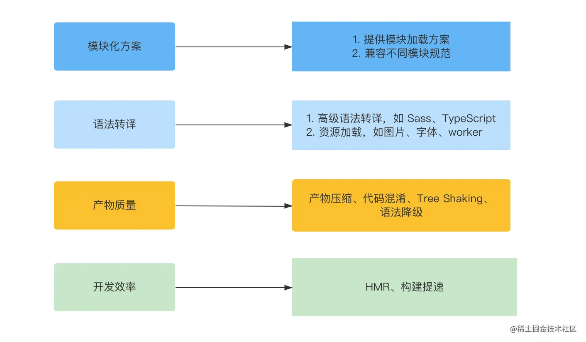

# 深入浅出 `Vite` -- 神三元

### 开篇 ：让 `Vite` 助力你的前端工程化之路

#### 前端工程都有哪些痛点
- 模块化
- 兼容浏览器，编译高级语法
- 线上代码的质量
- 开发效率、项目的冷启动/二次启动时间、热更新时间

  
#### 为什么 Vite 是当前最高效的构建工具？
- 模块化方面，Vite 基于浏览器原生 ESM 的支持实现模块加载，并且无论是开发环境还是生产环境，都可以将其他格式的产物(如 CommonJS)转换为 ESM。
- 语法转译方面，Vite 内置了对 TypeScript、JSX、Sass 等高级语法的支持，也能够加载各种各样的静态资源，如图片、Worker 等等。
- 产物质量方面，Vite 基于成熟的打包工具 Rollup 实现生产环境打包，同时可以配合Terser、Babel等工具链，可以极大程度保证构建产物的质量。

### 2、 模块标准：为什么 `ESM` 是前端模块化的未来？

#### 无模块化标准阶段存在的问题


### 3、 快速上手: 如何用 `Vite` 从零搭建前端项目？
- 一个import 语句即代表一个 HTTP 请求
- "一个 import 语句代表一个 HTTP 请求",如果发送请求较多，会不会占用IO线程等其他问题？
    - 请求数量太多的话首屏加载会比较慢，但后续由于有协商缓存，一般情况下页面加载性能也是可以接受的
  
- vite是不支持vue2的构建吗？
    - vite-plugin-vue2
    
- 如果在导入path的时候报错，说找不到path模块，需要安装：pnpm install @types/node --save-dev；
  安装成功后，如果显示path只能在使用"allowSyntheticDefaultImports"标志时进行默认导入，需要去tsconfig.node.
  json文件中，在compilerOptions中设置一条属性："allowSyntheticDefaultImports": true。如果tsconfig.json里配置了allowSyntheticDefaultImports还是报错，有可能是配置了"references": [{ "path": "./tsconfig.node.json" }]，然后再去tsconfig.node.json配置"allowSyntheticDefaultImports": true就可以了

### 4、 样式方案：在 `Vite` 中接入现代化的 `CSS` 工程化方案

#### QA
 - Tailwind CSS IntelliSense 没有提示的话
   -  settings-json设置
  ```json
"tailwindCSS.includeLanguages": {
    "html": "html",
    "javascript": "javascript",
    "css": "css"
  },
  "tailwindCSS.classAttributes": ["class", "className", "ngClass"],
  "editor.quickSuggestions": { "strings": true }
```
```ts
import { AttributifyAttributes } from 'windicss/types/jsx'

declare module 'react' {

 interface HTMLAttributes<T> extends AttributifyAttributes {}

}

#改一下shim.d.ts的配置。三元写的这种不生效了
```

- tailwind和postcss的配置文件，在Vite3.X版本要把后缀名改为.cjs, 不然会报模块错误。

- [我找到了如何配置自动注入less的配置了
  github.com](https://link.juejin.cn/?target=https%3A%2F%2Fgithub.com%2Fwebpack-contrib%2Fless-loader%23additionaldata)
  除此之外
  [如果要配置umi中的文件自动注入可以参考
  github.com](https://link.juejin.cn/?target=https%3A%2F%2Fgithub.com%2Fumijs%2Fumi%2Fissues%2F4131)
  
- 在src下面新建types/shim.d.ts

- [autoprefixer 可以参考这篇文章juejin.cn](https://juejin.cn/post/6901943749916491783)

- 补充, styled component中需要更好的debug可以参考[github.com](https://github.com/styled-components/babel-plugin-styled-components/issues/350) 这样可以显示一些有意义的className前缀

### 5、 代码规范: 如何利用 `Lint` 工具链来保证代码风格和质量？

### 6、 静态资源: 如何在 `Vite` 中处理各种静态资源？

### 7、 预构建: 如何玩转秒级依赖预构建的能力？

### 8、 双引擎架构: `Vite` 是如何站在巨人的肩膀上实现的？

### 9、 得力的性能推手: `Esbuild` 功能使用与插件开发实战

### 10、 `Vite` 构建基石(上)—— `Rollup` 打包基本概念及使用

### 11、 `Vite` 构建基石(下)——深入理解 `Rollup` 的插件机制

### 12、 插件开发与实战: 如何开发一个完整的 `Vite` 插件？

### 13、 `HMR API` 及原理：代码改动后，如何进行毫秒级别的局部更新？

### 14、 代码分割：打包完产物体积太大，怎么拆包？

### 15、 语法降级与 `Polyfill` ：联合前端编译工具链，消灭低版本浏览器兼容问题

### 16、 预渲染：如何借助 `Vite` 搭建高可用的服务端渲染( `SSR` )工程？

### 17、 模块联邦: 如何实现优雅的跨应用代码共享？

### 18、 再谈 `ESM` ：高阶特性 & `Pure ESM` 时代

### 19、 性能优化: 如何体系化地对 `Vite` 项目进行性能优化？

### 20、 配置解析服务：配置文件在 `Vite` 内部被转换成什么样子了？

### 21、 依赖预构建：`Esbuild` 打包功能如何被 `Vite` 玩出花来？

### 22、 插件流水线：从整体到局部，理解 `Vite` 的核心编译能力

### 23、 热更新：基于 `ESM` 的毫秒级 `HMR` 的实现揭秘

### 24、 手写 `Vite` : 实现 `no-bundle` 开发服务(上)

### 25、 手写 `Vite` : 实现 `no-bundle` 开发服务(下)

### 26、 手写 `Bundler`: 实现 `JavaScript AST` 解析器——词法分析、语义分析

### 27、 手写 `Bundler`: 实现代码打包、 `Tree Shaking`

### 28、 加餐: `Vite` 3.0 核心更新盘点与分析
